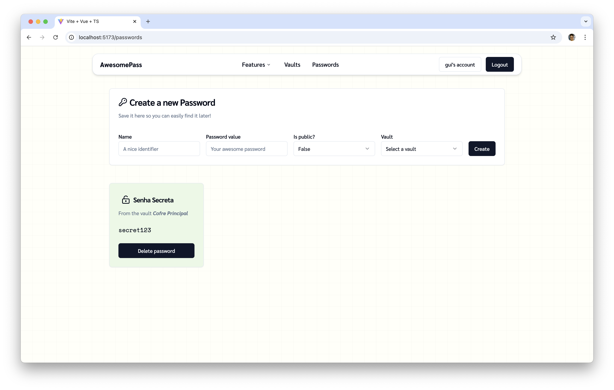

# Gerenciador de Senhas

Um gerenciador de senhas e notas, como o 1Password e LastPass.

Porém, ele é centralizado e possui duas visões. Os usuários têm a capacidade de criar novas Senhas e Cofres que podem ser não-públicos (visíveis apenas para ele e outros usuários autenticados) ou públicos (visíveis para todos que acessarem o site).

## Membros da equipe

414941, Guilherme Santos Rodrigues

## Como executar a aplicação

- `cd my-strapi-project`
- `npm run develop`
- `cd front-password-manager` (em um outro terminal)
- `npm run dev`
- Abrir a URL no navegador: http://localhost:5173/

## Referências visuais

## Resultados
### Homepage

### Página de senhas com o usuário logado

### Página de cofres com usuário deslogado

## Papéis ou tipos de usuário da aplicação

- Usuário não registrado, que apenas visualiza
- Usuário registrado, que visualiza e cria entradas (senhas e notas)
- Administrador, que consegue editar e deletar entradas de qualquer usuário.

## Entidades ou tabelas do sistema

- Usuário
- Password (representa algo que o usuário deseja salvar, pode ser um login/senha, uma chave de API, uma simples nota. Qualquer pedaço de informação que o usuário deseja armazenar. Se quiser, ele também pode compartilhar essa informação e deixar pública, como um Gist do GitHub).
- Cofre/Vault (representa um local que armazena as Entries, ou seja, um cofre que organiza os dados que o usuário criou. Por exemplo, o usuário pode ter o cofre "Faculdade" e armazenar suas senhas dos sistemas da faculdade, além disso, ele pode ter o cofre "Pessoal", que armazena senhas e logins pessoais)

## Principais funcionalidades da aplicação

- Usuário não registrado consegue ver Passwords e Cofres/Vaults públicos.
- Usuário registrado consegue criar/visualizar/editar/deletar Passwords.
- Usuário registrado consegue criar/visualizar/editar/deletar Cofres/Vaults.
- Usuário registrado consegue associar as Entries com Cofres/Vaults.

## Tecnologias e frameworks utilizados

**Frontend:**

VueJS v3.0, Vue-Router, Pine, Axios, Tailwind, Shadcn-vue

**Backend:**

Strapi

## Operações implementadas para cada entidade da aplicação

| Entidade| Criação | Leitura | Atualização | Remoção |
| --- | --- | --- | --- | --- |
| Usuário | X |  X  |  |  |
| Entry | X |  X  |  X | X |
| Vault | X |  X  | X | X |

## Rotas da API REST utilizadas

| Método HTTP | URL               |
|-------------|-------------------|
| GET         | /api/entries      |
| POST        | /api/entries      |
| GET         | /api/entries/:id  |
| PUT         | /api/entries/:id  |
| DELETE      | /api/entries/:id  |
| GET         | /api/vaults       |
| POST        | /api/vaults       |
| GET         | /api/vaults/:id   |
| PUT         | /api/vaults/:id   |
| DELETE      | /api/vaults/:id   |
